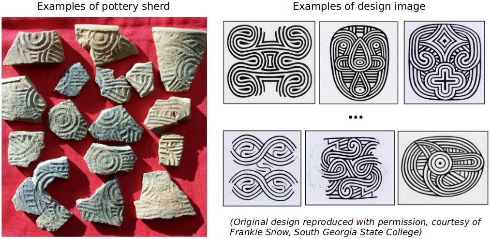
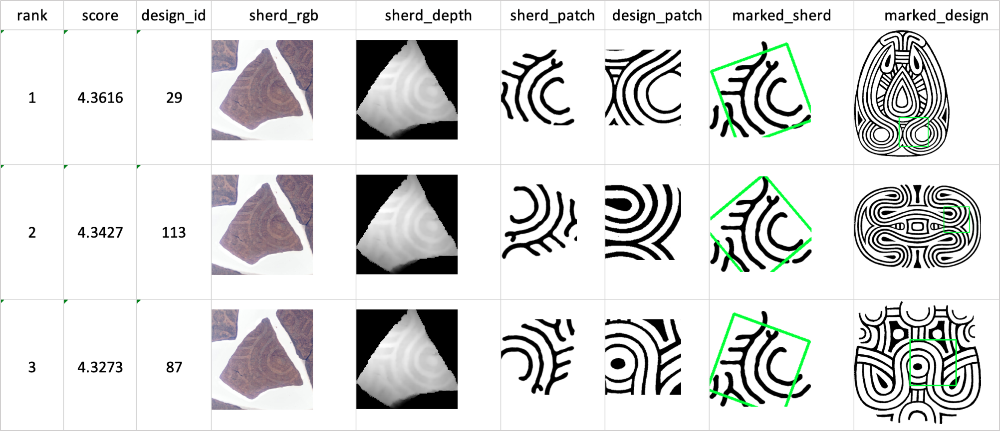

## Introduction
[SnowVision](https://github.com/rudylyh/SnowVision) is a project of exploring the application of deep learning and computer vision techniques in traditional archeological heritage fragment recognition. It is part of the World Engraved project ([http://worldengraved.org](http://worldengraved.org/index)).

The aim of SnowVision is to automate the matching process between fragmentary stamped pottery sherds from the archaeological record and their appropriate complete paddle design from among the hundreds of registered design reconstructions in the corpus. Example of sherds and designs are shown as below.

<p align="center">

</p>

Technically, our goal is to find the ground truth design of the query sherd in the design database and the corresponding location.

<p align="center">

</p>


## How to use
#### Requirements:
- torch==1.5.0
- pcl==1.8.0
- opencv==3.4.1
- skimage==0.10.1

#### Input:
- 3D scans of pottery sherds with the format of xyz file (./input)
- A design database (./designs)

#### Output:
For each sherd in a scan, we build a subfolder which contains:
- Point cloud of each sherd ('./output/SHERD_ID/sherd.xyz')
- Depth image of each sherd ('./output/SHERD_ID/depth.png')
- Mask image of each sherd ('./output/SHERD_ID/mask.png')
- Extracted curves of each sherd ('./output/SHERD_ID/curve.png')
- Matching result of each sherd ('./output/SHERD_ID/match_result.xlsx')
- Exact matching locations of each sherd ('./output/SHERD_ID/match_loc.xlsx')

Example of the matching result:
<p align="center">

</p>

#### Before running:
- Use makefile to build a xyz processing library named 'libxyz_proc.so'

    `$ make`

#### Usage example:
- For one scan:

    `$ python main.py --in-dir ./input --scan-name SCAN000702-1.xyz --out-dir ./output`

- For batch processing (process all scans in the input folder):

    `$ python main.py --in-dir ./input --out-dir ./output`

- Parameters that could be adjusted are listed in './config.json'.


#### Experimental result:
We use our method to match 247 raw sherds with a database of 100 designs, and get the below CMC curve. It means Y% of sherds could find the correct design in top-X matches. Each sherd takes about 5-10 mins.
<p align="center">

</p>


## Citation
```
@inproceedings{lu2018curve,
  title={Curve-structure segmentation from depth maps: A CNN-based approach and its application to exploring cultural heritage objects},
  author={Lu, Yuhang and Zhou, Jun and Wang, Jing and Chen, Jun and Smith, Karen and Wilder, Colin and Wang, Song},
  booktitle={Thirty-Second AAAI Conference on Artificial Intelligence},
  year={2018}
}
@incollection{zhou2019framework,
  title={A Framework for Design Identification on Heritage Objects},
  author={Zhou, Jun and Lu, Yuhang and Smith, Karen and Wilder, Colin and Wang, Song and Sagona, Paul and Torkian, Ben},
  booktitle={Proceedings of the Practice and Experience in Advanced Research Computing on Rise of the Machines (learning)},
  pages={1--8},
  year={2019}
}
```
