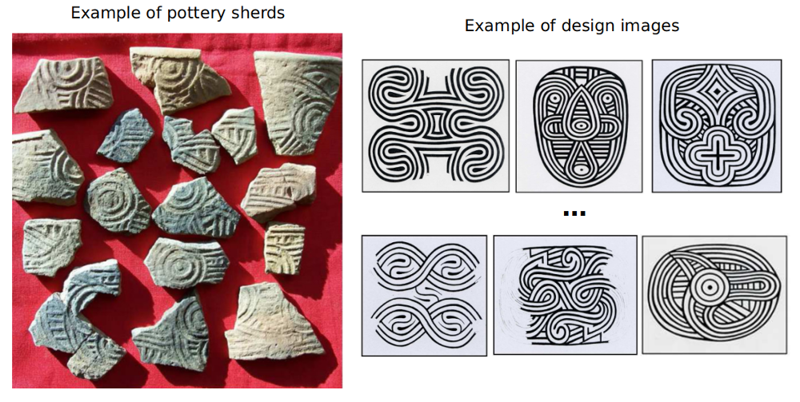

## Introduction

[SnowVision](https://github.com/rudylyh/SnowVision) is a project of exploring the application of deep learning and computer vision techniques in traditional archeological heritage fragment recognition. It is part of the World Engraved project ([http://worldengraved.org](http://worldengraved.org/index)).

The aim of SnowVision is to automate the matching process between fragmentary stamped pottery sherds from the archaeological record and their appropriate complete paddle design from among the hundreds of registered design reconstructions in the corpus. Example images are shown below.

Technically, our goal is to find the ground truth design of the query sherd in the design database and the corresponding location.

